# Community Hub App developed with Flutter <a href="https://flutter.dev" target="_blank" rel="noreferrer"> </a>

## Fun-fact 🤩: This project was developed in 3 days.


Design Credit: (https://www.figma.com/file/5fsoomMbg1nbIkBgsFeDaD/DoorHub-UI-KIt--Figma-Community-(Community))


## 📸 Screenshots

### Light

| 1                                               | 2                                               | 3                                                                             |
|-------------------------------------------------|-------------------------------------------------|-------------------------------------------------------------------------------|
| 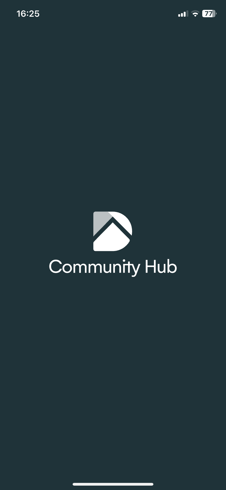 | 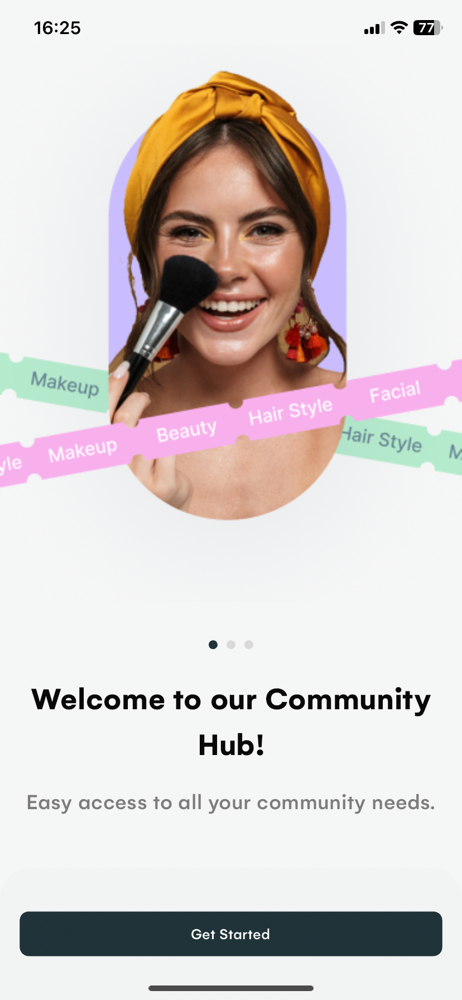 | 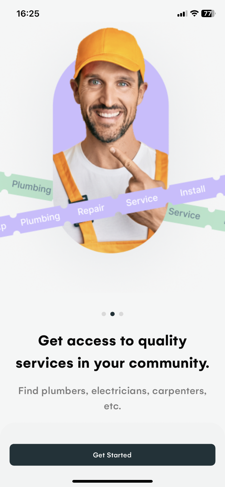 |

| 4                                               | 5                                               | 6                                                                              |
|-------------------------------------------------|-------------------------------------------------|--------------------------------------------------------------------------------|
| 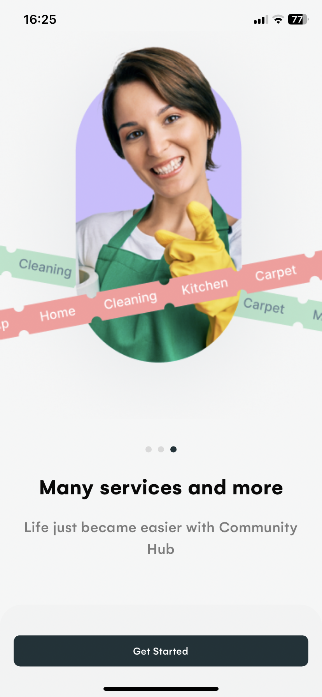 | 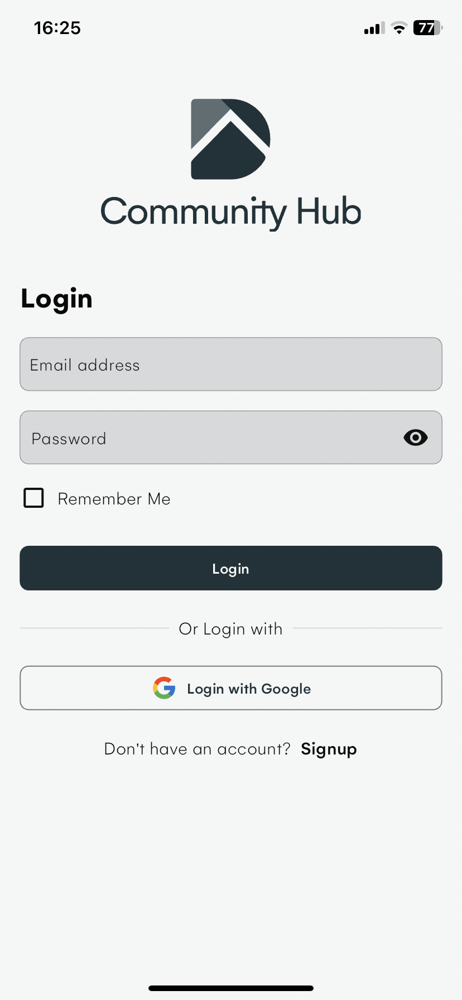 | 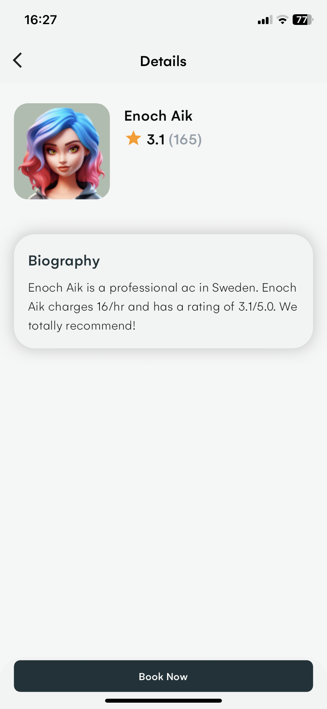 |


| 7                                               | 8                                               | 9                                                                             |
|-------------------------------------------------|-------------------------------------------------|-------------------------------------------------------------------------------|
| 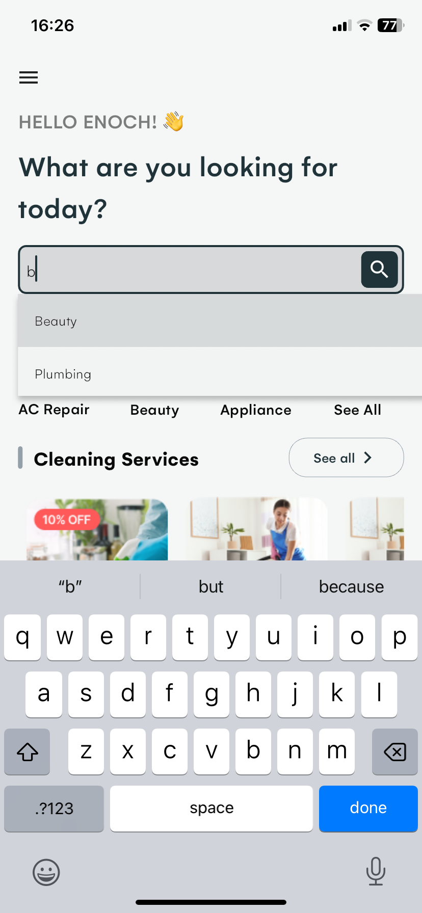 | 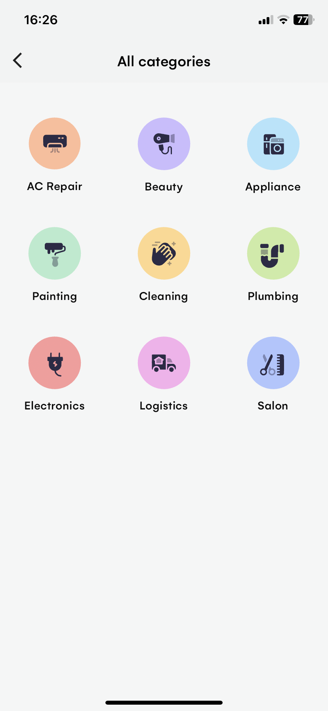 | 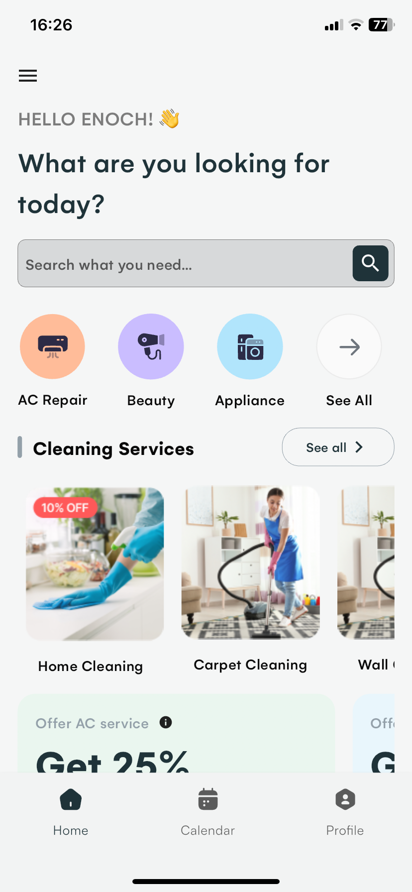 |


| 10                                              | 11                                               | 12                                                                             |
|-------------------------------------------------|--------------------------------------------------|--------------------------------------------------------------------------------|
| 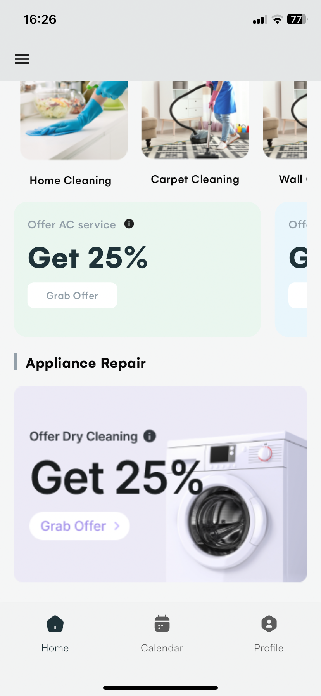 | 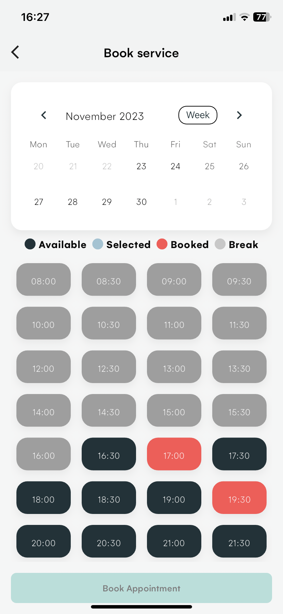 | 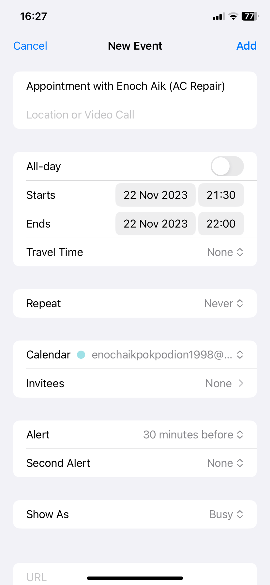 |


### Dark

| 1                                              | 2                                              | 3                                                                            |
|------------------------------------------------|------------------------------------------------|------------------------------------------------------------------------------|
| 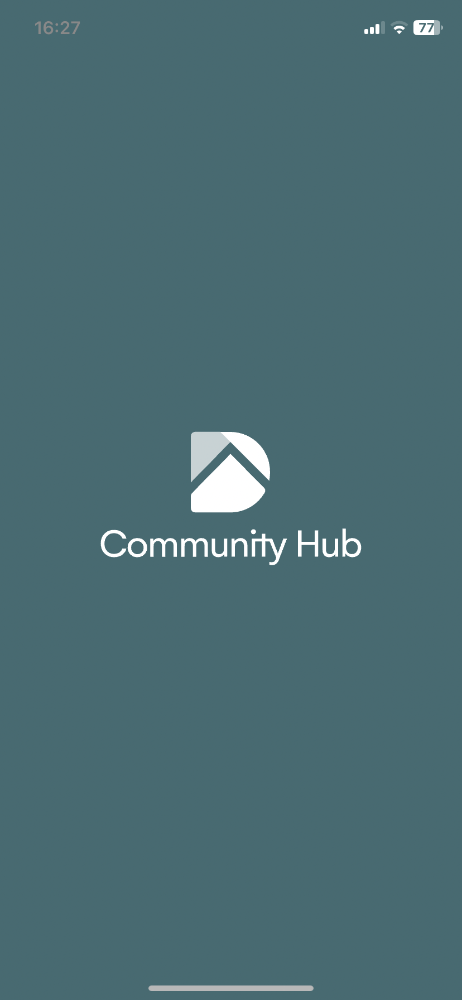 | 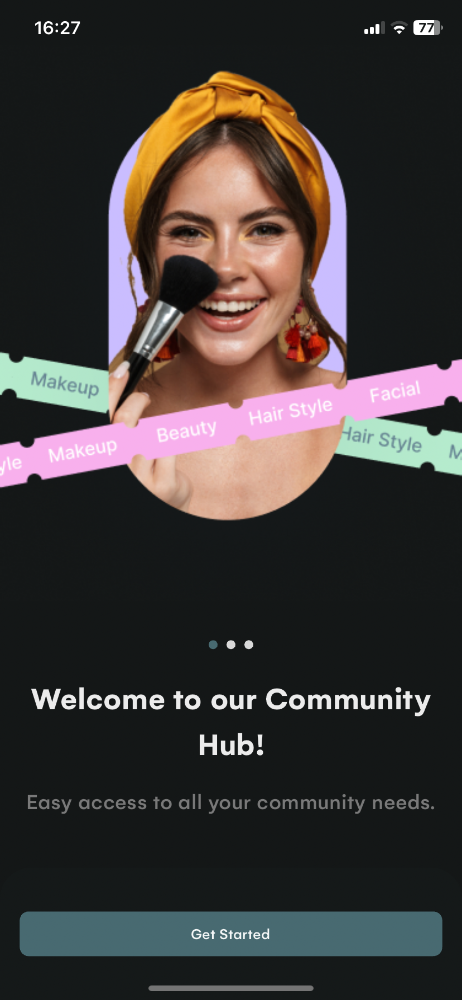 | 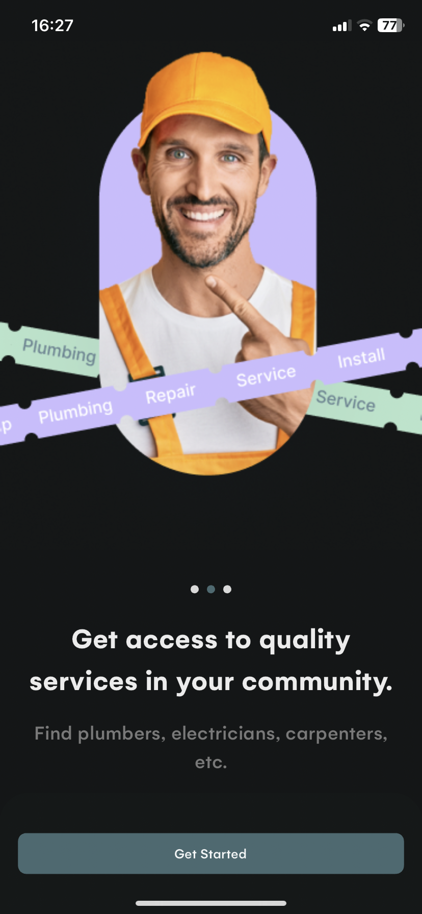 |

| 4                                                                            | 5                                              | 6                                                                            |
|------------------------------------------------------------------------------|------------------------------------------------|------------------------------------------------------------------------------|
| 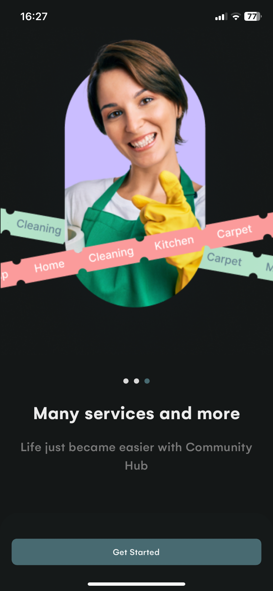 | 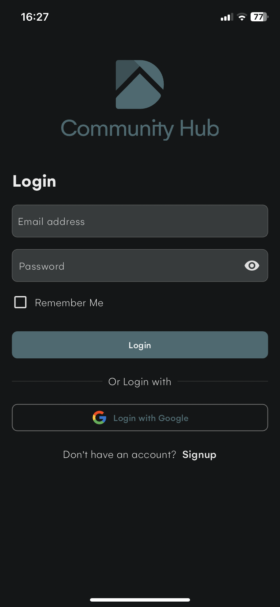 | 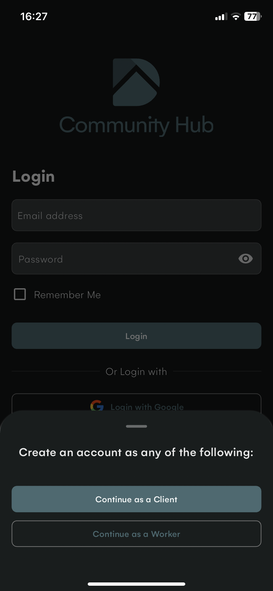 |

| 7                                              | 8                                              | 9                                              |
|------------------------------------------------|------------------------------------------------|------------------------------------------------|
| 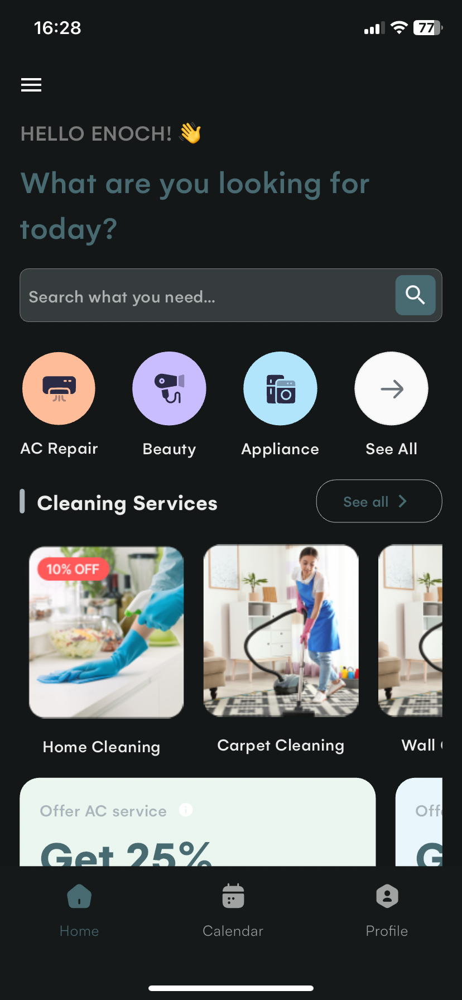 | 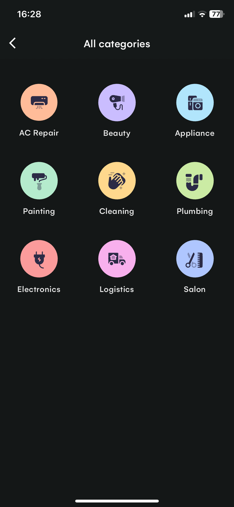 | 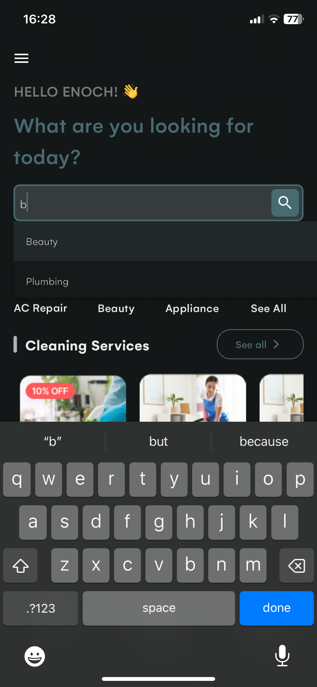 |

| 10                                              |
|-------------------------------------------------|
| 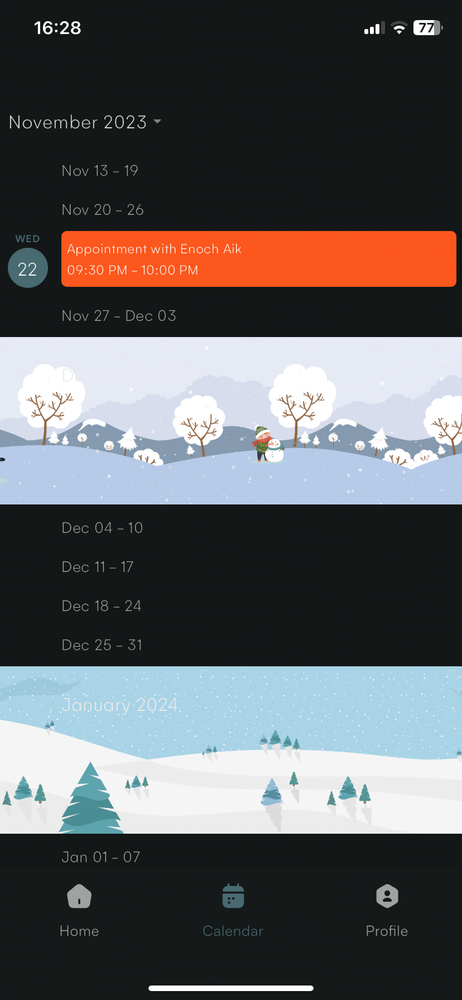 |

## 📱 Features:
- ### Client
- [ ] Google Maps
- [ ] In-app purchase
- [ ] App Wallet
- [ ] View Profile
- [ ] View Settings
- [x] Authentication & Google Sign In
- [x] View Worker's Profile
- [x] Search and view different services
- [x] Book Service
- [x] Add booking to Calendar
- [x] Push Notifications
- [x] Calendar schedule view


- ### Worker
- [x] Authentication
- [x] View upcoming bookings
- [x] Push Notifications
- [x] Calendar schedule view

## Packages & Libraries Used

* [Flutter SVG](https://github.com/dnfield/flutter_svg) (SVG)
* [Flutter ScreenUtil](https://github.com/OpenFlutter/flutter_screenutil) (Responsive UI)
* [Dio](https://github.com/flutterchina/dio) (API calls)
* [Riverpod](https://github.com/rrousselGit/river_pod) (State management)
* [Json Serialization](https://github.com/dart-lang/json_serializable) (Serialization)
* [Intl](https://github.com/dart-lang/intl) (Localization)
* [Firebase Messaging](https://github.com/firebase/flutterfire/tree/master/packages/firebase_messaging/firebase_messaging) (Messaging and Notification)
* [Firebase Core](https://github.com/firebase/flutterfire/tree/master/packages/) (Messaging and Notification)
* [Firebase Auth](https://github.com/firebase/flutterfire/tree/master/packages/) (Authentication)
* [Firestore](https://github.com/firebase/flutterfire/tree/master/packages/) (Database)
* [Google Sign In](https://github.com/firebase/flutterfire/tree/master/packages/) (Google Authentication)


## Getting Started

This project is a starting point for a Flutter application that is using
Serverpod.

A great starting point for learning Serverpod is our documentation site at:
[https://docs.serverpod.dev](https://docs.serverpod.dev).

Don't forget to check out the Serverpod Flutter package at:
[https://pub.dev/packages/serverpod](https://pub.dev/packages/serverpod).


To run the project, first make sure that the server is running, then do:

    cd community_hub_flutter
    flutter run

## How to use

**Step 1**

Download or clone this repo by using the link below
```
https://github.com/enoch-aik/community_hub.git
```

**Step 2**

Go to project root and execute the following command in console to get the required dependencies:

```
flutter pub get
```

## Hide Generated Files

In-order to hide generated files, navigate to `Android Studio` -> `Preferences` -> `Editor` -> `File Types` and paste the below lines under `ignore files and folders` section:
